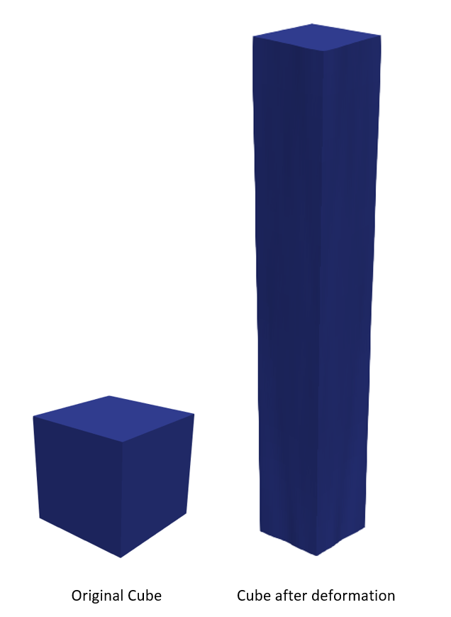

# Abaqus

In order to test Femtech’s speed multiple test simulations were run on FEMTech; the same simulations were then run on ABAQUS to establish a comparison. For each case, the same simulation was run 5 times and the average runtime was compared. Each mesh is run on 1, 2, 4, 8 and 16 processors to test scalability.

19683 elements cube (273): The original cube has a side of 1mm and is stretched in the y direction by 7mm. 

FEMTech and ABAQUS speeds get comparable at 8 processors and above and FEMTech is faster than ABAQUS at 16 processors.

