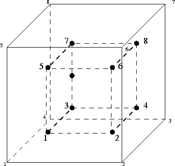

# C3D8 - 8 node hex

Can you see this in Figure 

$$
x=1 \tag{1}
$$

Check out this page: [http://what-when-how.com/the-finite-element-method/fem-for-3d-solids-finite-element-method-part-2/](http://what-when-how.com/the-finite-element-method/fem-for-3d-solids-finite-element-method-part-2/)

