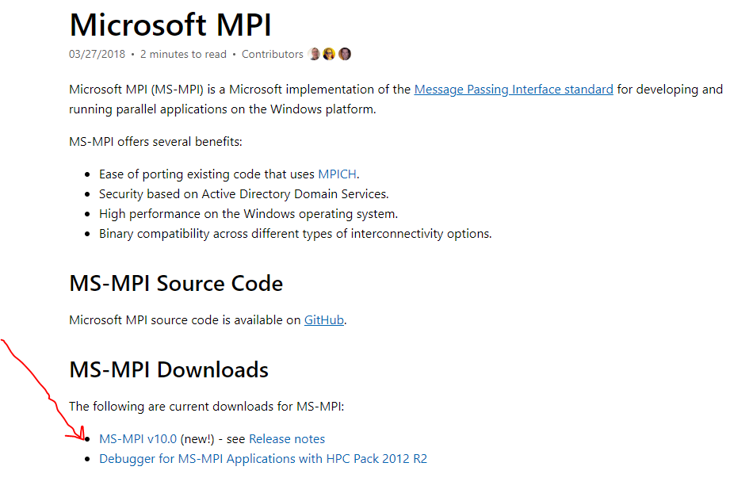
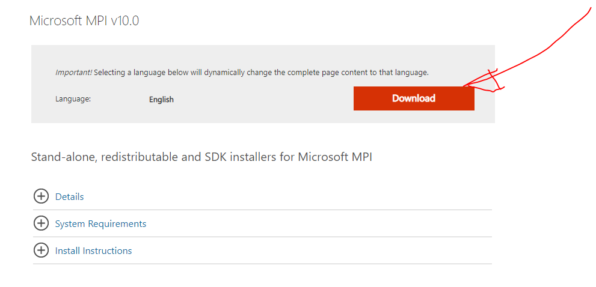
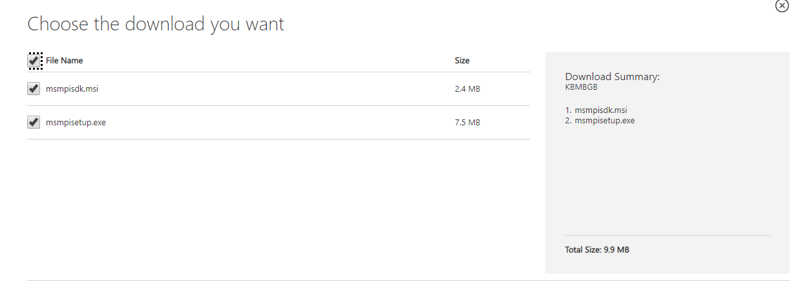

# Windows

## CMake

* CMake-GUI:  [https://cmake.org/download](https://cmake.org/download/)

## Visual Studio

 Visual Studio 2017. We use the free community version.

## Microsoft MPI

You want to download the Microsoft MPI libraries. A good place to start is here: [https://docs.microsoft.com/en-us/message-passing-interface/microsoft-mpi](https://docs.microsoft.com/en-us/message-passing-interface/microsoft-mpi)  
Here we see there is a version 10:

It is **CRITICAL** that you download both the SDK and the MPI setup.exe. **YOU NEED BOTH!!!**

The next **CRITICAL** thing to do is **restart your computer** so your system environment variables get set. I don't believe there is another way around this if you don't admin privileges \(as I did not\).

## Paraview for Visualization

Download from: [https://www.paraview.org](https://www.paraview.org/)

